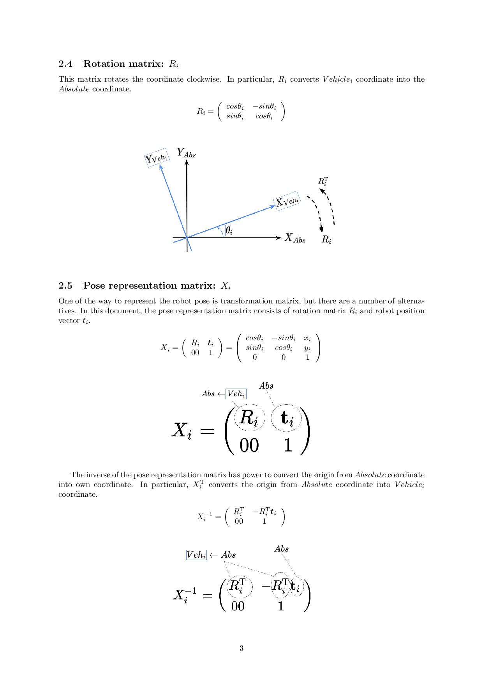
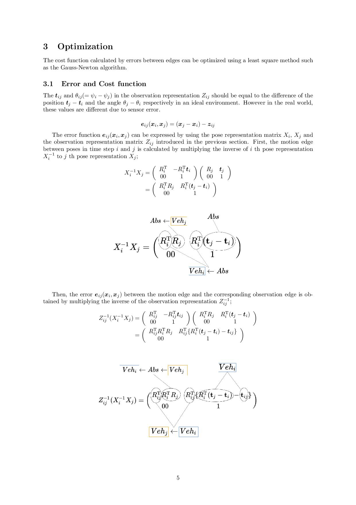
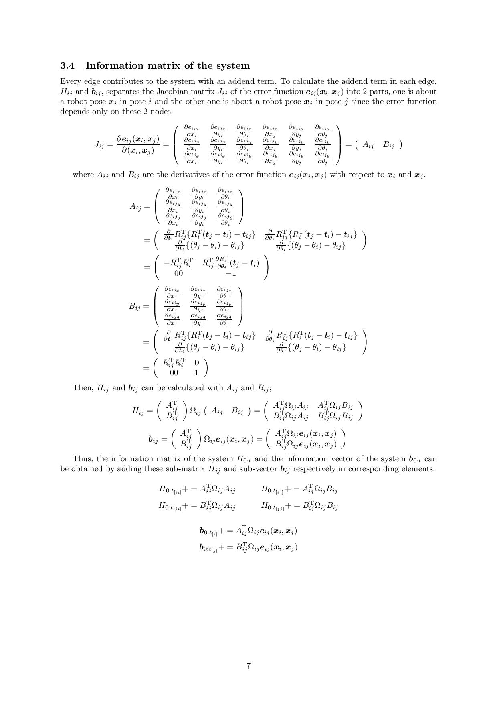
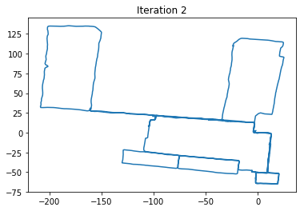
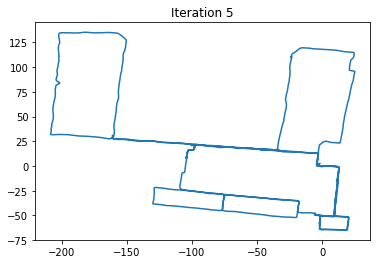

# Graph Based SLAM

Explanation of Graph based SLAM with C++ and Python sample code

## Explanation

[tex/Graph-Based-SLAM_english.pdf](./tex/Graph-Based-SLAM_english.pdf)

|  |  |  |
| :---: | :---: | :---: |
|  |  |  |

## Sample code [C++]

[sample_code_cpp](./sample_code_cpp/)

| Odometry only | Sample SLAM |
| :---: | :---: |
|  |  |

## Sample code [Python]

[sample_code_python](./sample_code_python/)

|  |  |  |
| :---: | :---: | :---: |
|  |  |  |