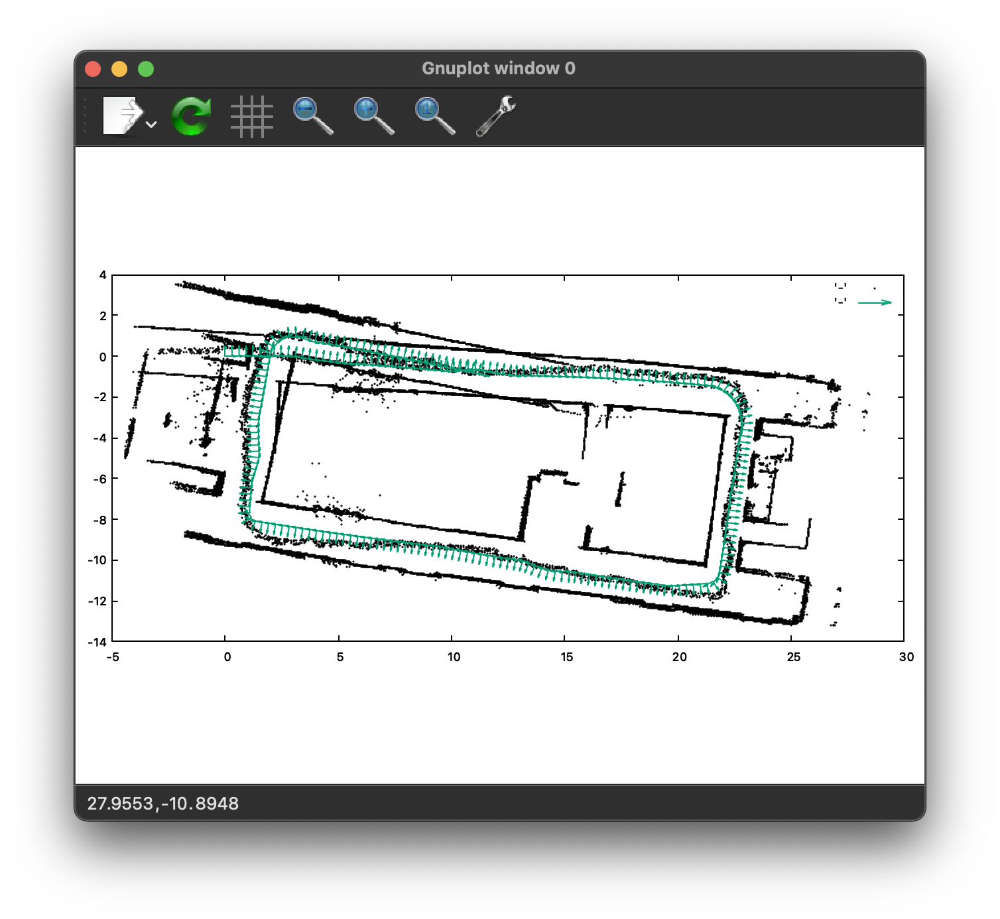
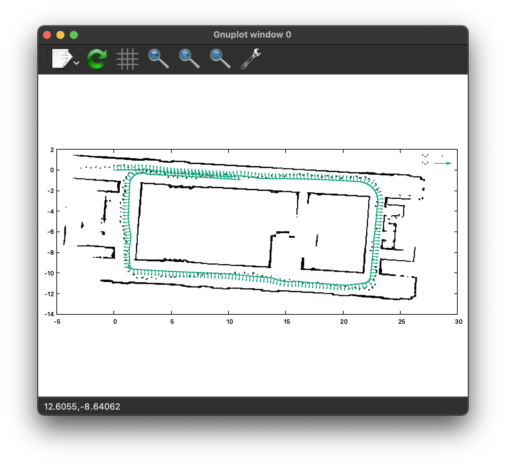
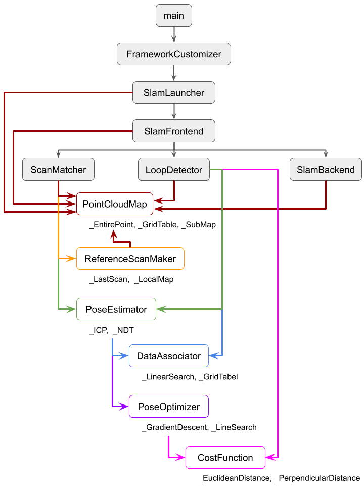

# Sample SLAM

Scan matching as a front-end, Graph based SLAM as a back-end.
Inspired by [furo-org/LittleSLAM](https://github.com/furo-org/LittleSLAM).

| Odometry only | Sample SLAM |
| :---: | :---: |
|  |  |

The framework can be customized in `framework.cfg` by Factory Method as shown below:

| Module | Type | Description |
| --- | --- | --- |
| PointCloudMap | _EntirePoint | Stores entire laser point |
|  | _GridTable | Stores laser points in a grid based manner |
|  | _SubMap | Stores laser points in a grid based manner with sub maps |
| ReferenceScanMaker | _LastScan | Last scan as a reference scan for scan matching |
|  | _LocalMap | Local map as a reference scan for scan matching |
| PoseEstimator | _ICP | Iterative Closest Point |
|  | _NDT | Normal Distribution Transform (WIP) |
| DataAssociator | _LinearSearch | Linear search to find corresponding laser points |
|  | _GridTabel | Grid based search to find corresponding laser points |
| PoseOptimizer | _GradientDescent | Gradient descent with a fixed step rate |
|  | _LineSearch | Gradient descent with a dynamic step rate determined by line search |
| CostFunction | _EuclideanDistance | Euclidean distance as an error distance |
|  | _PerpendicularDistance | Perpendicular distance as an error distance |

<br/>



# Pre-requirements

* Boost
* CMake
* Eigen
* gnuplot

## Install on Ubuntu

```
$ sudo apt-get install build-essential libboost-all-dev cmake libeigen3-dev gnuplot gnuplot-x11
```

## Install on Mac

```
$ brew install boost cmake eigen gnuplot
```


# How to build

```
$ git clone --recursive https://github.com/hotsuyuki/Graph-Based-SLAM.git
$ cd Graph-Based-SLAM/
$ cd sample_code_cpp/src/
$ mkdir build
$ cd build/
$ cmake ..
$ cmake --build .
```

This command downloads [google/googletest](https://github.com/google/googletest) using [Crascit/DownloadProject](https://github.com/Crascit/DownloadProject) and produces an executable file named `main` in the `build` directory.


# How to run

The executable file `main` requires at least two arguments:

* `data-file` ... path to the input scan data
* `viz-mode` ... visualization mode: *scan* | *odom* | *slam*

## (a) Launch SLAM

```
$ ./main --data-file ../../data/corridor.lsc --viz-mode slam
```
or
```
$ ./main ../../data/corridor.lsc slam
```

## (b) Odometry only

```
$ ./main --data-file ../../data/corridor.lsc --viz-mode odom
```
or
```
$ ./main ../../data/corridor.lsc odom
```

## (c) Check scan data

```
$ ./main --data-file ../../data/corridor.lsc --viz-mode scan
```
or
```
$ ./main ../../data/corridor.lsc scan
```

The full arguments and options are shown below:

```
usage:
  main [OPTION...] data-file viz-mode

positional arguments:
  data-file  String: Path to sensor data file (.lsc)
  viz-mode   String: Visualization mode ... scan | odom | slam

options:
  -h, --help  Print usage
```


# How to test

The program can be tested with Google C++ Testing Framework.

```
$ cd Graph-Based-SLAM/
$ cd sample_code_cpp/src/build/
$ ./test/utility/utility_test
```


# References

* [furo-org/LittleSLAM](https://github.com/furo-org/LittleSLAM)
* [furo-org/p2o](https://github.com/furo-org/p2o/tree/768dee340de702a6eee61f7b0172a836d1e021ea)
* [TadaoYamaoka/cxxopts/include/cxxopts.hpp](https://github.com/TadaoYamaoka/cxxopts/blob/master/include/cxxopts.hpp)